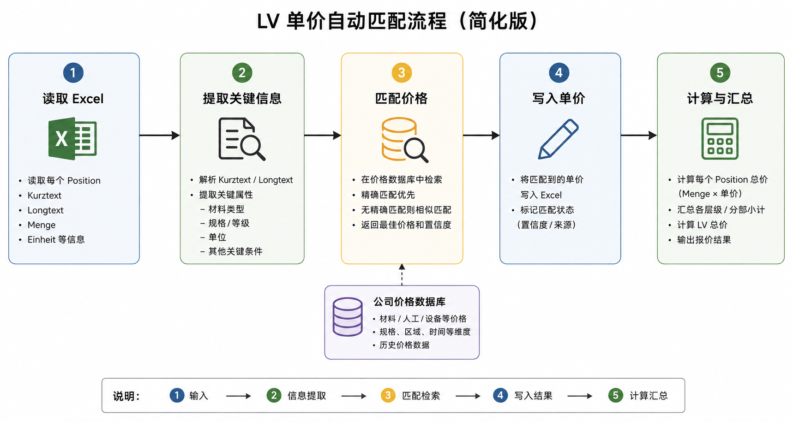

# lv-price-engine (LV 自动报价辅助系统)
AI-assisted construction price matching based on tender positions and supplier price data.

## 1. 介绍

当前 Kalkulation 工作主要基于 **iTWO** 平台完成。

iTWO 中的 LV 数据具有相对固定的结构。每个 LV 按层级组织，并由多个 Position 组成。每个 Position 通常包含固定字段，例如：

* OZ
* Positionsnummer
* Kurztext
* Longtext
* Menge
* Einheit

整个报价和 Kalkulation 流程都在 iTWO 中完成，并通过标准化的数据格式进行交换。

由于 LV 的数据结构和 Position 描述形式相对稳定，因此具备较好的自动化处理基础。

## 2. 需求

目标是开发一个辅助报价系统，自动完成部分 Position 的单价匹配。

系统需要：

* 从 Excel 中逐个读取 Position
* 分析 Kurztext 和 Longtext
* 提取材料、规格、等级、单位等关键属性
* 根据提取结果查询价格数据库
* 找到最合适的价格
* 自动填写对应的 Einheitspreis
* 在价格填写完成后计算 Position 总价及 LV 汇总价格

系统应优先自动处理高置信度结果，对于无法可靠匹配的 Position 保留人工审核。

## 3. 数据来源

价格数据主要可能来自以下几个来源：

* **公司内部价格数据库**

  * 公司已有的材料、人工、设备等价格数据
  * 历史项目中使用过的价格
  * 历史 Position 及对应 Einheitspreis

* **客户提供的数据**

  * 某些 LV 或项目可能附带已有的价格或参考数据库

* **新增和维护的数据**

  * 当前数据库中不存在的价格需要人工补充
  * 已有价格需要根据时间、供应商、地区等因素持续更新

因此价格数据库本身也是系统的重要组成部分，需要长期维护。

## 4. 核心流程



整体流程可以简化为：

```text
Excel Position
→ 提取 Kurztext / Longtext 等信息
→ 解析关键属性
→ 数据库检索与相似度匹配
→ LLM / 规则进一步判断
→ 得到建议单价
→ 写回 Excel
→ 计算并汇总价格
```

- 其中信息提取可以采用规则与 LLM 相结合的方式。
- 对于格式明确的信息，例如材料等级、单位、型号等，可优先使用规则或正则表达式提取。
- 对于复杂的 Longtext，则可以使用 LLM 进行语义理解和结构化解析。

## 5. 数据库与向量检索

由于同一种材料或 Leistung 可能存在多种不同描述，仅通过关键词或数据库精确查询可能无法覆盖所有情况。

因此可以将：

- 当前 Position 的 Kurztext / Longtext
- 数据库中的历史描述或 Preisposition

转换为向量，并通过向量数据库进行相似度检索。

基本思路：

```text
Position 描述
→ Embedding
→ Vector Search
→ 返回 Top-K 相似价格项 / 历史 Position
→ 根据关键字段和业务规则进行二次筛选
```

向量搜索主要解决“不同写法但语义相近”的问题，而 **材料等级、单位、规格等** 关键字段仍需要进行严格校验。

## 6. 匹配策略

建议采用混合方式，而不是完全依赖 LLM 或 Vector Search：

**结构化字段匹配 + Vector Search + LLM/规则判断**

例如：

1. 从 Longtext 中提取 `Beton / C30/37 / XC4 / m³`
2. 使用这些字段过滤价格数据库
3. 对剩余候选项进行向量相似度比较
4. 使用规则或 LLM 判断候选项是否真正适用
5. 返回价格以及匹配置信度

这样既能提高检索覆盖率，也可以避免仅凭语义相似度导致错误报价。

## 7. 预期结果

系统最终不是完全替代 Kalkulator，而是减少大量重复的人工查价和填写工作。

理想结果是：

**自动匹配明确 Position → 人工只审核低置信度或特殊 Position。**

这样可以提高 LV 报价处理速度，同时保留人工对最终价格的控制。
