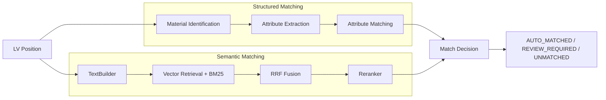

# lv-price-engine

**AI-assisted construction price matching based on GAEB tender positions and construction price data.**

`lv-price-engine` 是一个面向建筑工程 **Leistungsverzeichnis (LV)** 的辅助 Kalkulation 系统。  
目标是从 LV Position 中识别材料相关信息，并从价格数据库中检索和推荐最合适的 Commodity 与价格。

系统不会完全替代 Kalkulator，而是优先自动处理高置信度结果，并将不确定结果交给人工审核。

## Input Data

### GAEB X83

当前系统支持读取 **GAEB X83** 文件，并解析：

- GAEB ID
- OZ
- Kurztext
- Longtext
- Menge
- Einheit

对应模块：

```text
src/ingestion/
└── gaeb_lv_loader.py
```

### Artikel XML

材料与价格数据来自结构化 Artikel XML，并导入 PostgreSQL。

当前主要数据结构：

```text
ProductGroup
    ↓
CommodityGroup
    ↓
Commodity
    ├── CommodityPrice
    └── EstimatePrice
```

数据库包含 5 个主要表：

```text
product_groups
commodity_groups
commodities
commodity_prices
estimate_prices
```

## Material Understanding

为了提升 LV Position 与 Commodity 的匹配准确度，系统会先从原始文本中提取结构化的材料信息，再将这些结构化属性用于后续匹配。

当前流程可以概括为：

```text
Free Text
    ↓
Material Identification
    ↓
Structured Material Attributes
    ↓
Commodity Matching
```

目前已支持 4 类常见材料：
```text
concrete
reinforcing_steel
reinforcement_mesh
reinforcement_accessory
```

每一种材料通过独立的 Material Template 进行定义，主要包括：

- Keywords：用于识别材料类型
- Core Attributes：对材料匹配起决定作用的核心属性
- Supplementary Attributes：用于进一步区分相似材料的补充属性

例如，对于混凝土，系统可以从：
```text
Normalbeton C 35/45, XC4, XD1, XF2, XA1, WA
```

中提取出：
```text
Material: concrete
Core Attributes:
- Strength Class: C 35/45
- Exposure Classes: XC4, XD1, XF2, XA1
- Moisture Class: WA
Supplementary Attributes:
- Concrete Type: Normalbeton
```

通过这种方式，系统不再只依赖整段文本的语义相似度，而是可以同时利用明确的工程材料属性进行匹配。

材料模板和属性定义通过配置文件维护，因此后续可以继续扩展新的材料类型和属性，而不需要修改主要匹配流程。

## Matching Pipeline

当前匹配流程结合 **Structured Material Matching** 与 **Semantic Retrieval / Reranking**：



当前模型：

- Embedder: BAAI/bge-m3
- Sparse Retrieval: BM25
- Fusion: Reciprocal Rank Fusion (RRF)
- Reranker: BAAI/bge-reranker-v2-m3

## Match Status

每个 LV Position 最终会得到一个 `PositionMatchResult`：

```text
AUTO_MATCHED
REVIEW_REQUIRED
UNMATCHED
```

- **AUTO_MATCHED**：Rank 1 Candidate 足够明确，可以自动采用。
- **REVIEW_REQUIRED**：多个 Candidate 较为接近，需要人工确认。
- **UNMATCHED**：当前数据库中没有足够可靠的候选。

## Text Processing

LV Position 和 Commodity Candidate 会先通过 `TextBuilder` 转换为统一的检索文本。

例如：

```text
LV (short text + long text + unit):
Unit: m3 | Ortbeton Streifenfundamente | Normalbeton C30/37 XC3 XF1 XA2 W0 ...

Candidate (category path + label + description + unit):
Unit: m³ | Stoffe | Beton | Lieferbeton, Ortbeton | Beton C30/37 XC3 XF1 XA2 W0
```

`TextBuilder` 只负责：

```text
Domain Object
→ Retrieval / Ranking Text
```

Retriever 和 Reranker 本身不负责业务文本生成。

## Project Structure

```text
src/
├── config/
├── database/
├── db_article_importing/
├── ingestion/
├── text_processing/
│   └── text_builder.py
├── retrieval/
│   ├── base_retriever.py
│   ├── vector_retriever.py
│   └── bm25_retriever.py
├── fusion/
│   └── rrf_fusion.py
├── ranking/
│   ├── base_reranker.py
│   └── bge_reranker.py
├── matching/
│   └── match_pipeline.py
├── models/
├── exporter/
└── logging/
```

主要职责：

- `ingestion`：读取 GAEB X83
- `db_article_importing`：解析 Artikel XML 并导入数据库
- `database`：读取 Commodity 与价格数据
- `text_processing`：生成 Retrieval / Ranking Text
- `retrieval`：Vector / BM25 Candidate Retrieval
- `fusion`：融合多个 Retriever 的排序结果
- `ranking`：使用 Cross-Encoder Reranker 精排
- `matching`：编排整个 Matching Workflow
- `exporter`：输出 LV、Candidate 和 Match Results

## Current Scope

当前系统主要解决：

```text
LV Position
→ Material / Commodity Matching
→ Material Price Recommendation
```

需要注意：

**Material Price ≠ 完整 Einheitspreis**

完整 LV Einheitspreis 可能还包含：

```text
Material
+ Lohn
+ Geräte
+ Transport
+ Sonstiges
```

因此当前系统主要提供材料价格匹配，而不是完整施工报价。

另外，LV Unit 与 Commodity Unit 也不一定相同，例如：

```text
LV:        m²
Commodity: m³
```

未来需要进一步加入：

```text
Unit Normalization
Unit Compatibility
Quantity Conversion
```

## Model Configuration

模型通过 YAML 配置：

```yaml
embedder:
  name: bge-m3
  path: ./models/embedding/bge-m3
  device: cuda
  trust_remote_code: false

reranker:
  name: bge-reranker-v2-m3
  path: ./models/reranker/bge-reranker-v2-m3
  device: cuda
  trust_remote_code: false
```

模型在 `MatchPipeline` 创建之前完成加载，并通过 Dependency Injection 传入。

## Future Development

后续计划包括：

- Reranker 与 Threshold Evaluation
- Unit Compatibility / Quantity Conversion
- Vector Database / pgvector
- Material Cost Calculation
- 完整 Einheitspreis / Gesamtpreis Calculation

## Goal

长期目标是建立一个 **AI-assisted Kalkulation System**：

> Automatische Verarbeitung klarer Positionen – manuelle Prüfung nur dort, wo fachliche Entscheidung wirklich notwendig ist.
